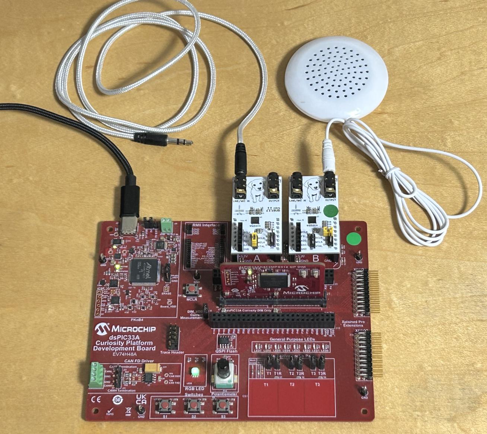

# dspic33ak-audio-dsp-sonora



A multichannel audio DSP application and reference implementation for the
Microchip dsPIC33AK family. It boots the clock tree, brings up two WM8904
codecs over I2S/TDM, runs an audio processing graph (or a bidirectional
asynchronous sample-rate converter), and exposes everything over a serial
console you can drive by hand while the audio keeps running.

*Sonora* is the project name. The repository is a complete MPLAB X project: no
generated application source, no external project templates, no vendor
configurator step. (One exception, noted where it matters below:
`resident_bootloader.X`'s *project* is generated from a manifest so the two
cannot drift — the source it builds is hand-written like everything else.)

> **Hardware note.** The WM8904 codec board's EasyEDA design files are
> published separately in
> [sulaolab/EasyEDA-WM8904-mikroBUS](https://github.com/sulaolab/EasyEDA-WM8904-mikroBUS).
> The [Hardware](#hardware) section below shows the board this project assumes
> and describes how it attaches to the Curiosity Platform.

**New here? Read [Quick start](#quick-start) and build `Classic 1`.** That is
the profile the project treats as its reference: two codecs, one clock domain,
a DSP chain you can hear and switch on and off from the console. Everything
else in this README is optional depth.

## What is in the box

- **Audio transport** — I2S and TDM over a reusable dsPIC33AK SPI/I2S/TDM HAL,
  with codec-master and dsPIC-master clock topologies both supported.
- **Classic DSP chain** — biquad/IIR and FIR filters, bass enhancement,
  de-essing, stereo widening, sample delay, reverb, a DRC cascade, and
  tone/synth/AVAS generators. Every block is switchable at run time.
- **ASRC** — a bidirectional, independent-clock-domain sample-rate converter
  with a drift servo, 16 independent channel states per direction, and an
  automatic anti-alias front end for low output rates.
- **Serial console** — every demo parameter, plus status and load telemetry, on
  a 230400 baud console over the on-board PKOB4 CDC port.
- **CMSIS integration** — CMSIS-DSP, plus CMSIS-Driver USART/I2C/SAI
  implementations over the native HALs.
- **Host-side tooling** — PowerShell build/flash scripts and Python analysis
  utilities, both self-contained in the tree.

## Hardware

| Item | Detail |
| --- | --- |
| MCU board | EV74H48A dsPIC33AK Curiosity Platform |
| Devices | `dsPIC33AK512MPS512` (full feature set), `dsPIC33AK128MC106` (reduced) |
| Codec boards | Two WM8904 mikroBUS boards, in the platform's two mikroBUS slots (AK512 only — AK128 initializes MikroBUS-A alone) |
| Programmer | On-board PKOB4 (also carries the console CDC port) |
| Console | 230400 8N1 on the PKOB4 CDC virtual COM port |

Every configuration in this repository assumes this codec board:


An in-house design: a WM8904 with its own 12.288 MHz crystal and a mikroBUS
footprint. Each WM8904 answers I2C at the same fixed address; the two boards
are told apart by wiring, not addressing — each is meant to sit on its own
I2C controller (MikroBUS-A and MikroBUS-B on independent physical buses), a
hardware precondition covered below. Each board can either take its master
clock from its own crystal (codec-master topology) or be clocked by the
dsPIC (dsPIC-master topology); which one applies is chosen by a jumper on the
board and by the build profile. Its EasyEDA design files are published
separately:
**[sulaolab/EasyEDA-WM8904-mikroBUS](https://github.com/sulaolab/EasyEDA-WM8904-mikroBUS)**
(CC0-1.0) — the board above is rev.04, the revision built and verified on
hardware.

Three facts worth knowing before you debug silence:

- A codec-master profile needs the crystal jumper fitted on the board that is
  supposed to be the master. With no master clock the transport starts but no
  bit clock is produced.
- The first run after a fresh flash starts from a cold codec. Codec register
  state is only fully known after the initialization sequence completes; judge
  audio quality from the second run onwards.
- **Every dual-codec build (`Classic *`, `ASRC *`) expects both WM8904 boards
  physically present, on independent I2C buses.** There is no runtime
  detection of a missing or bridged second codec — a build that declares two
  codecs and gets an unanswering WM8904-B fails its codec-apply step, prints
  what to check, and stops (it does not retry forever). Two supported hardware
  arrangements are:
  - Fit both boards in the Curiosity Platform's two mikroBUS slots, and
    **depopulate the Curiosity Platform's own A/B I2C bridge resistors
    (R38/R39)** — the platform ships with them fitted, which puts both
    mikroBUS I2C buses on the same wire. With them removed, MikroBUS-A and
    MikroBUS-B are independent I2C buses, which is what every dual-codec
    profile assumes.
  - Or run with a single WM8904 board — `Classic` profiles only (ASRC needs
    both codecs and cannot run single-codec) — by overriding
    `APP_REQ_MIKROB_WM8904` to `0` in `src/app/app_specific_config_defs.h`
    (or via an MPLAB preprocessor define) before building. This is a source
    override, not a `switch_config.ps1` choice.

## Prerequisites

| Tool | Version used by this project |
| --- | --- |
| MPLAB X IDE | Any release that supports the XC-DSC toolchain (IDE is optional; see below) |
| XC-DSC compiler | 3.31.01 |
| Device pack | `dsPIC33AK-MP_DFP` 1.3.185 |
| PowerShell | 7 (`pwsh`) — the build scripts are PowerShell |
| Python | 3.11+ — required by `build.ps1` to produce the delivery artifacts (`SERIAL_UPDATE_PACKAGE` / `FACTORY_IMAGE`), and used by the host-side analysis tools under `tools/` |

Flashing and resetting the board uses MPLAB X / MPLAB IPE and the on-board
PKOB4 — no separate host-side flash tooling is required for that. (A
standalone flash/reset helper for scripting this without MPLAB X installed
exists but is not part of this initial release; see `buildtools/README.md`.)

Two notes on the toolchain that save time later:

- **The command line is the supported build path.** MPLAB X is fully usable for
  editing, debugging and stepping, and a Clean and Build from the IDE works —
  but release artifacts, the resident-bootloader combination and the
  downloadable update image are produced only by the scripts in `buildtools/`.
- **XC-DSC builds are not byte-reproducible.** Section names are randomised, so
  two builds of identical sources produce different hex and object hashes.
  Compare behaviour and map contents, never hashes.

## Quick start

```powershell
# 1. Choose what to build. Run with no arguments for an interactive menu.
.\buildtools\switch_config.ps1

# ...or script the same three choices directly:
.\buildtools\switch_config.ps1 -SerialUpdateSupport Yes `
                               -Device dsPIC33AK512MPS512 `
                               -Profile 'Classic 1'

# 2. Build the active selection.
.\buildtools\build.ps1              # -Full for a clean rebuild
```

**3. Program the board.** Program `resident_bootloader.X`, then
`dspic33ak_audio_dsp.X`, via MPLAB X or MPLAB IPE and the on-board PKOB4 — in
that order (their linker scripts place them in disjoint flash regions on
purpose). See ["IDE-only path"](#ide-only-path-first-boot--learning) below for
the click-through version. If you have the standalone flash/reset helper
(`buildtools/README.md`), `.\buildtools\flashauto.ps1` does the same two-image
program-and-reset from the command line.

Then open the PKOB4 CDC port at **230400 8N1**. The banner prints the profile
and the build, `?` prints the console grammar and module-letter legend, and
the `Classic 1` chain is running with a co-clocked codec pair: WM8904-A drives
BCLK/FS and WM8904-B follows it.

The selection persists in `buildtools/active_build.json` (untracked), so a bare
`build.ps1` or `flashauto.ps1` later in the day follows what you chose. Every
script resolves paths against its own repository, not the current directory, so
these commands work from anywhere.

### IDE-only path (first boot / learning)

For a first hands-on boot without touching a script, MPLAB X alone can build
and flash both halves of a serial-update image:

1. Open `resident_bootloader.X` and `dspic33ak_audio_dsp.X` in MPLAB X.
2. Select the `dsPIC33AK512_CLASSIC_SERIAL_UPDATE` (or `..._ASRC_...`)
   configuration on the application project, Clean and Build both projects.
3. Program `resident_bootloader.X`, then `dspic33ak_audio_dsp.X`, via
   PKOB4 — in that order. Their linker scripts place them in disjoint flash
   regions on purpose (that separation is what makes the resident-bootloader
   design work at all); verified working end to end on AK512/Classic.
4. Reset the board.

This is enough to see the board boot and talk on the console. It is **not**
how to produce anything you would ship, though: `resident_bootloader.X` is a
generated, debug-only project — the resident bootloader you'd actually deliver
comes from `build_resident_bootloader.ps1`, which stamps a commit hash into
the image that a manual IDE build does not. See `buildtools/README.md`'s
"Support scope: command line vs MPLAB X" section for the full script-vs-IDE
breakdown.

## Choosing a build

`switch_config.ps1` asks up to three questions and derives everything else:

1. **Serial update support** — resident bootloader plus serial firmware
   update, or a standalone application flashed directly. As of 2026-08-15,
   every shipped configuration on both devices is serial-update-only (the
   standalone configurations were deleted), so this question is now skipped
   rather than asked — `-SerialUpdateSupport` still accepts `Yes` explicitly,
   and `No` is rejected on both devices. See `buildtools/README.md` for the
   full history.
2. **Target device** — `dsPIC33AK512MPS512` or `dsPIC33AK128MC106`.
3. **Application profile** — the feature set.

The MPLAB configuration is *not* one of the three: it is derived from the
device and the profile, because those two already determine it.

Profiles are grouped by tier so the default menu stays short. `-Advanced` adds
profiles that need extra hardware or a measurement setup; `-All` also shows the
internal ones used for development, comparison and load checks. `-Profile
<name>` selects any profile regardless of tier.

```powershell
.\buildtools\switch_config.ps1 -List -All   # every profile with its tier
```

### The profiles you are likely to want

Each WM8904 board carries a two-position jumper selecting its MCLK source:
**XTAL** (the board's own 12.288 MHz crystal drives MCLK — that board is the
TDM/BCLK master) or **BCLK** (MCLK is derived from elsewhere — that board
follows). Set both boards' jumpers to match the profile *before* flashing; a
mismatched jumper is a silent-audio fault, not a build or console error.

| Profile | Jumper A | Jumper B | What it is |
| --- | --- | --- | --- |
| `Classic 1` | XTAL | BCLK | **Start here.** Co-clocked dual codec; WM8904-A drives BCLK/FS, B follows. |
| `Classic 2` | BCLK | BCLK | The same chain with the dsPIC driving BCLK/FS instead — neither codec is its own master. |
| `Classic DRC` | XTAL | BCLK | Co-clocked dual codec with a DF2T DRC cascade. |
| `Classic 96k` | XTAL | BCLK | Non-USB 96 kHz, co-clocked dual codec. |
| `ASRC Codec BI` | XTAL | XTAL | The default, hardware-validated ASRC: WM8904-B is codec master on its own crystal, bidirectional A↔B — the only profile here where both boards run from their own crystals. |
| `ASRC dsPIC BI` | XTAL | BCLK | The same ASRC with the dsPIC as B's master instead of B's own crystal. |

Two Classic profiles take USB audio input (48 kHz and 96 kHz) and are marked
advanced because they need the USB connection wired up. The remaining ASRC
profiles are one-way routes, measurement captures, decimator studies and
kernel A/B candidates; they exist to reproduce specific results, not to be
demos.

`buildtools/README.md` documents every profile, what it guarantees, its
per-device availability, and the troubleshooting for when a build or a flash
does not behave. Classic configurations never compile ASRC application
sources, and vice versa; a maintainer-side ratchet enforces that in the development
tree.

## How the code is laid out

```text
apps/            which application, and its run-time behaviour
   |
audio_transport/ the transport runtime the applications share
   |
board/           Sonora hardware facts: pins, clock tree, codecs, LEDs, buttons
   |
hal_*/           peripheral HALs — portable across dsPIC33AK boards
cmsis_driver/    CMSIS-Driver USART / I2C / SAI over those HALs
```

Dependencies only ever point downwards. Board code states hardware facts and
never chooses application behaviour; HAL code knows nothing about Sonora.
That is what makes the HALs reusable, and it is checked rather than trusted.

| Path | Contents |
| --- | --- |
| `src/app/apps/` | The Classic and ASRC entries, their build variations, Classic's `classic/dsp/` blocks, shared audio utilities, and the selected-app contract. |
| `src/app/board/` | Sonora pin routing, TDM topology, clock policy, codec and peripheral device support. |
| `src/app/hal_*/`, `src/app/cmsis_driver/` | Peripheral HALs and the CMSIS-Driver layer over them. |
| `src/app/dspic33-cmsis-dsp/` | Vendored CMSIS-DSP for dsPIC33A. |
| `dspic33ak_audio_dsp.X/` | The MPLAB X project, for both supported devices. |
| `buildtools/` | Configuration switching, build, flash, reset, and the gate scripts. |
| `src/linker/` | Linker script for the serial-update memory map. |
| `docs_public/` | Public, reusable integration documentation — see `docs_public/README.md`. |
| `tools/` | Host-side analysis and packaging utilities (Python and PowerShell). |
| `src/tests/` | Host-side tests for the tooling and for bit-exactness fixtures. |

## Documentation

- [`docs_public/nora_hal_public_api.md`](docs_public/nora_hal_public_api.md) — the HAL API
  surface, and the conventions every HAL follows.
- [`docs_public/wm8904_codec_master_and_rates.md`](docs_public/wm8904_codec_master_and_rates.md)
  — the codec-master topology and the sample-rate handling that goes with it.
- [`docs_public/hal_timer_integration.md`](docs_public/hal_timer_integration.md) — integrating
  the timer HAL.
- [`docs_public/avas_type_ty_l1_line_model.md`](docs_public/avas_type_ty_l1_line_model.md) — the
  AVAS line-model engine: the clustered-carrier implementation, its cost, and its knobs.
- [`docs_public/avas_pitch_pot_design.md`](docs_public/avas_pitch_pot_design.md) — how the
  AVAS pitch trim shares the POT with the engine synth.
- [`docs_public/full_test.md`](docs_public/full_test.md) — the full-test procedure and its
  pass criteria.
- [`buildtools/README.md`](buildtools/README.md) — the build system in full.
  English, like `README.md` and `docs_public/` — the directories that are published.

## Results worth quoting

The ASRC path is the load-critical one, and its numbers are hardware
measurements rather than estimates. The default profile (M30/L128, Kaiser
β=11, `fc=0.465`) runs 16 independent channel states per direction; a
20-minute soak of the bidirectional 48 kHz case measured 76.6% TDM-active
occupancy, with the 8 kHz endpoint's worst window at 90.0%, and no misses or
saturated windows
(`[internal] report_asrc_dsp_load_phase2_2026-07-28.md`;
the earlier six-window run of the same kernel is in
`[internal] report_asrc_m30_production_2026-07-27.md`).

Two things that number does *not* say: the physical codec transport is TDM8,
so 16 channels is a processing-capacity result, and the absolute peak carries a
build-layout offset of a few microseconds — only deltas measured within one
build are comparable.

## License

Original SulaoLab contributions are licensed under
[MIT No Attribution](LICENSE) (MIT-0) — © 2026 SulaoLab. Vendored and adapted
third-party components keep their own licenses and use restrictions; see
[THIRD_PARTY_NOTICES.md](THIRD_PARTY_NOTICES.md).
